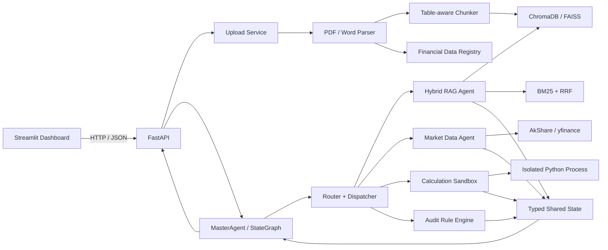

# RAG 多 Agent 财务报表分析系统

面向财务报告检索、精确计算、实时行情与勾稽审计的 Python 3.11 全栈项目。系统以结构化文档解析为入口，通过混合 RAG 召回财报证据，使用独立计算沙箱执行财务公式，再由确定性规则引擎完成跨报表校验。

## 系统架构



### 核心数据流

1. PDF/DOCX 通过 `/upload` 进入 Parser。
2. 段落按 Markdown 语义边界切片，表格按整行切片并重复表头。
3. 文本切片写入向量库，结构化财务字段写入本地注册表。
4. `/analyze` 根据问题生成 RAG、Market、Calculation、Audit 动态计划。
5. 节点通过 `AgentState` 传递证据，失败时根据重试上限补充检索。
6. FastAPI 返回最终答案、检索证据、计算代码、审计结果和可观测轨迹。

## 技术栈

| 分层 | 技术 |
| --- | --- |
| 文档解析 | python-docx, pdfplumber, pandas |
| RAG | ChromaDB / FAISS, BM25, Reciprocal Rank Fusion |
| Agent 编排 | LangGraph StateGraph，本地状态机回退 |
| 计算 | AST 审计, `python -I` 子进程, JSON 边界 |
| 实时数据 | AkShare, yfinance |
| API | FastAPI, Pydantic, Uvicorn |
| 前端 | Streamlit, HTTPX |

## 目录结构

```text
.
|-- agents/
|   |-- state.py                 # 共享状态与 reducer
|   |-- rag_agent.py             # 混合检索与财务数据结构化节点
|   |-- real_time_agent.py       # 实时行情与基本面节点
|   |-- calc_agent.py            # 公式生成与沙箱计算节点
|   |-- audit_agent.py           # 财务勾稽规则引擎
|   `-- master_agent.py          # Router / Dispatcher / Retry 图
|-- core/
|   |-- code_interpreter/
|   |   `-- calc_engine.py       # 隔离计算沙箱
|   |-- parsers/
|   |   |-- pdf_parser.py
|   |   `-- word_parser.py
|   |-- rag/
|   |   |-- retriever.py         # BM25 + Vector + RRF
|   |   `-- vector_store.py      # Chunking + ChromaDB / FAISS
|   `-- tools/
|       `-- market_data.py
|-- tests/
|   `-- test_agent_modules.py    # 独立 Agent 与真实 LangGraph 回归测试
|-- main.py                      # FastAPI 后端
|-- app.py                       # Streamlit Dashboard
`-- README.md
```

## 环境搭建

### 1. 创建 Python 3.11 环境

```powershell
conda create -n rag_311 python=3.11 -y
conda activate rag_311
python -m pip install --upgrade pip
```

### 2. 安装基础依赖

国内网络可使用清华镜像：

```powershell
python -m pip install -i https://pypi.tuna.tsinghua.edu.cn/simple --prefer-binary pandas python-docx pdfplumber fastapi "uvicorn[standard]" python-multipart streamlit httpx akshare yfinance
```

若只想先启动 Phase 4 页面，可先安装最小 Web 依赖，避免等待向量库与
LangGraph 等较大包：

```powershell
python -m pip install -i https://pypi.tuna.tsinghua.edu.cn/simple --prefer-binary fastapi "uvicorn[standard]" python-multipart streamlit httpx
```

### 3. 安装可选增强组件

ChromaDB 持久化向量库：

```powershell
python -m pip install -i https://pypi.tuna.tsinghua.edu.cn/simple --prefer-binary chromadb
```

FAISS 替代后端：

```powershell
python -m pip install -i https://pypi.tuna.tsinghua.edu.cn/simple --prefer-binary faiss-cpu
$env:RAG_BACKEND="faiss"
```

LangGraph 编排引擎：

```powershell
python -m pip install -i https://pypi.tuna.tsinghua.edu.cn/simple --prefer-binary "langgraph>=0.2"
```

`chromadb` 未安装时，API 默认降级为内存向量库。`langgraph` 未安装时，MasterAgent 使用相同转移规则的本地状态机。这两项不阻塞本地演示。

## 一键启动

终端 1：启动 FastAPI。

```powershell
conda activate rag_311
python main.py
```

终端 2：启动 Streamlit。

```powershell
conda activate rag_311
$env:API_BASE_URL="http://127.0.0.1:8000"
streamlit run app.py
```

运行 Agent 模块化回归测试：

```powershell
python -m unittest discover -s tests -v
```

服务地址：

- Dashboard: <http://127.0.0.1:8501>
- OpenAPI: <http://127.0.0.1:8000/docs>
- Health: <http://127.0.0.1:8000/health>

## API 契约

### `GET /health`

返回服务状态、实际向量后端、切片数和文档数。`memory` 后端标记为 `degraded`，用于提醒数据不会跨重启保留。

### `POST /upload`

`multipart/form-data` 字段：

| 字段 | 类型 | 必填 | 说明 |
| --- | --- | --- | --- |
| `file` | PDF/DOCX | 是 | 默认上限 50 MB |
| `year` | integer | 否 | 1900~2100，用于切片元数据 |

```powershell
curl.exe -X POST "http://127.0.0.1:8000/upload" -F "file=@annual_report.pdf" -F "year=2024"
```

### `POST /analyze`

```json
{
  "question": "计算 2024 年 ROE，并检查资产负债是否平衡",
  "mode": "deep",
  "symbol": "600519"
}
```

`mode=fast` 不执行补充检索环路；`mode=deep` 最多允许两次补充检索，并强制勾稽规则可执行。

## 配置项

| 环境变量 | 默认值 | 说明 |
| --- | --- | --- |
| `API_HOST` | `127.0.0.1` | FastAPI 监听地址 |
| `API_PORT` | `8000` | FastAPI 端口 |
| `API_RELOAD` | `false` | 开发热重载 |
| `API_BASE_URL` | `http://127.0.0.1:8000` | Streamlit 访问的 API |
| `CORS_ORIGINS` | `http://localhost:8501` | 逗号分隔的允许来源 |
| `RAG_BACKEND` | `chroma` | `chroma` 或 `faiss` |
| `ALLOW_MEMORY_FALLBACK` | `true` | 缺少向量库时允许内存回退 |
| `UPLOAD_DIR` | `data/uploads` | 上传文件与财务注册表 |
| `VECTOR_DIR` | `data/vectors` | 向量索引持久化目录 |
| `MAX_UPLOAD_MB` | `50` | 单文件大小上限 |
| `LOG_LEVEL` | `INFO` | 服务日志级别 |
| `EMBEDDING_PROVIDER` | `hash` | Embedding 提供方，`hash` 离线可跑，`dashscope` 使用云端通义 embedding |
| `DASHSCOPE_EMBEDDING_MODEL` | `text-embedding-v4` | DashScope embedding 模型，仅在 `EMBEDDING_PROVIDER=dashscope` 时使用 |
| `LLM_PROVIDER` | `rule` | 最终总结提供方，`rule` 使用内置规则总结，`dashscope` 使用 Qwen 生成自然语言分析 |
| `QWEN_LLM_MODEL` | `qwen-plus` | Qwen 总结模型，仅在 `LLM_PROVIDER=dashscope` 时使用 |
| `DASHSCOPE_API_KEY` | - | DashScope API Key，请配置为本机环境变量，不要写入代码或提交到 Git |

### 启用 DashScope / Qwen

默认配置使用 `hash` embedding 和规则总结，可离线运行。若要启用真实云端 embedding 和 Qwen 财报总结，请在本机设置环境变量：

```powershell
$env:EMBEDDING_PROVIDER="dashscope"
$env:DASHSCOPE_EMBEDDING_MODEL="text-embedding-v4"
$env:LLM_PROVIDER="dashscope"
$env:QWEN_LLM_MODEL="qwen-plus"
$env:DASHSCOPE_API_KEY="你的 DashScope Key"
```

Windows 用户变量可用以下方式永久保存模型配置；API Key 也应只保存在本机环境变量中：

```powershell
[Environment]::SetEnvironmentVariable("EMBEDDING_PROVIDER", "dashscope", "User")
[Environment]::SetEnvironmentVariable("DASHSCOPE_EMBEDDING_MODEL", "text-embedding-v4", "User")
[Environment]::SetEnvironmentVariable("LLM_PROVIDER", "dashscope", "User")
[Environment]::SetEnvironmentVariable("QWEN_LLM_MODEL", "qwen-plus", "User")
```

切换 embedding 模型后，需要删除或重建 `data/vectors`，避免旧 hash 向量与新 DashScope 向量混用。

## 安全与可观测性

- 上传同时校验扩展名、文件签名、大小和年份。
- 计算代码经过 AST 审计、导入白名单、隔离子进程、超时和输出限制。
- Agent 输出包含 `trace_id` 与 `workflow_trace`，界面展示可审计节点事件，不暴露隐式思维链。
- 生产环境应补充身份认证、租户隔离、限流、对象存储和 Docker/gVisor 级计算隔离。

## 已知边界

- 扫描版 PDF 没有文本层，入库前需 OCR。
- 默认哈希 embedding 用于离线启动，生产语义检索建议替换为 BGE-M3 或云端 embedding API。
- 内存向量库不持久化；生产请安装 ChromaDB 或 FAISS。
- Python 应用层沙箱不等于操作系统容器，多租户场景需额外基础设施隔离。

## 简历亮点

- 设计表格感知的财报 RAG 切片策略，保留表头、期间、数值与来源页码。
- 实现 Vector + BM25 + RRF 混合召回，改善财务术语语义匹配与精确数字召回。
- 基于 Typed Shared State 和条件边编排 RAG、行情、计算、审计 Agent，支持有上限的自动纠错环路。
- 将 LLM 生成公式交给受限 Python 子进程执行，通过确定性计算和规则引擎降低财务幻觉。
- 使用 FastAPI async 路由、Pydantic 契约、CORS 和 Streamlit 会话状态完成端到端可观测交互。
